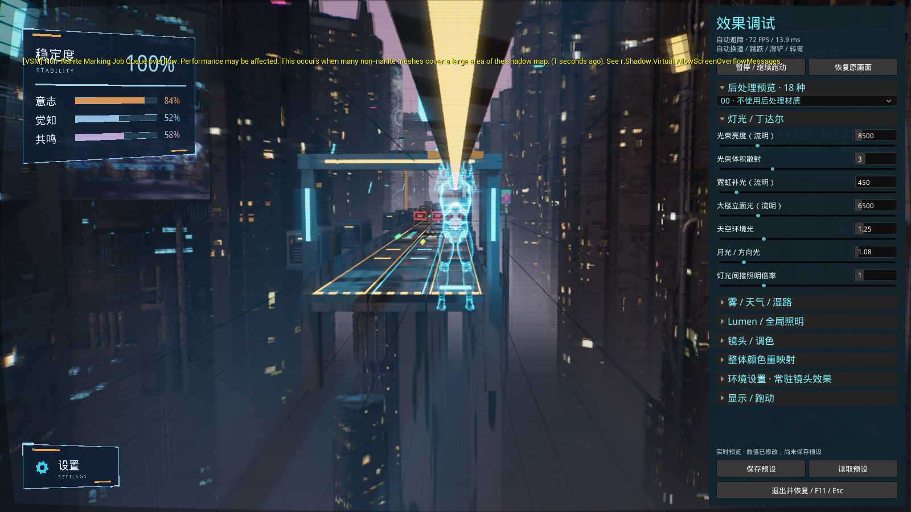

# GHOST RUN

### 身份未知 · 继续前行

**以 AI 即时回应、动作叙事与环境导演为核心特色的赛博朋克叙事跑酷游戏。**

你在向前跑。身后的塔奇克马要求你停下，接受身份检查。你拒绝了，却还说不清自己为什么拒绝。

你想知道自己是谁。但一个编号、一份档案、一次判定，能回答这个问题吗？

GHOST RUN 让玩家带着这个矛盾穿过城市：躲避、转弯、收集碎片，听见追捕者的判断，再从一次次中断的奔跑中拼出自己的记录。**跑得多远决定你还能看见什么；留下什么记录，决定这次奔跑如何被理解。**

**[下载 Windows 可玩 Demo · 约 1.90 GiB](https://github.com/ningbo00/ghostRun/releases/download/v0.1.0-hackathon/GhostRun_Demo_Win64_20260924_100604.zip)** · [发布页与校验文件](https://github.com/ningbo00/ghostRun/releases/latest)

普通模式无需 Unreal 编辑器、Python 或 API 密钥。完整解压后，运行 `Windows/Start_Game.cmd`。

## AI 如何参与这个世界

**GHOST RUN 的核心特色，是让 AI 参与“观察行动 → 解释行动 → 回应玩家 → 留下记录”的过程，并把回应延伸到城市的视觉氛围。**

你转过一个路口、撞上障碍、拾取碎片，都会改变这一局正在发生的事情。游戏将相关事件与状态交给不同的 AI 通道，让即时通讯、动作档案、局后回顾和环境表现围绕玩家的经历展开。作者编写的关键记忆则维持故事的连续性。

### 1. 会结合处境回应的追捕者

塔奇克马同时拥有追踪职责与好奇心。它可以观察、猜测、提醒，也可以继续要求身份检查。这个角色的张力来自两件并存的事：**它正在追你，也正在试着理解你。**

接入真实模型后，通讯系统会提供当前事件、稳定度、场景与路线信息、剧情阶段和近期台词，供模型生成短回应。于是，通讯可以围绕眼前发生的事展开：刚刚受到伤害、进入新的场景，或从紧张追逐进入缓和阶段。

角色设定约束它的语气与知情范围；游戏状态提供当下的事实。玩家面对的是一个持续参与这场追逐的观察者，而它对玩家的描述，也构成身份主题的一部分。

### 2. 把你的动作写进叙事

动作叙事系统将转向、越过缺口、迟疑等事件组织为过去、现在、未来三个视角：过去留下了什么记录，现在能够核对什么，追捕者下一步准备做什么。

**配置模型后，部分无声档案短句可依据实际动作事件即时生成。** 请求中包含动作、触发条件、时间视角和原始参考句，并要求短句符合世界设定与声部语气。奔跑中的一个反应，因此有机会成为一条属于当下的记录。

固定记忆章节承载长期叙事；已配音的通讯保留原文，保持声音与字幕一致。这样的组合让即时表达具有变化，同时保留可逐步拼合的故事线索。

### 3. 让城市回应当前处境

AI 环境导演可以同时返回通讯台词、允许的氛围预设，以及一个视觉意图。视觉意图由本地执行器转成有范围限制的渲染参数，并平滑过渡到画面中。

| AI 视觉意图 | 玩家能够看到的变化 |
| --- | --- |
| **路线清晰** | 暗部更清楚，雾略薄，泛光收敛，突出前方空间 |
| **霓虹城市** | 增强城市灯光、霓虹与拖光，突出都市氛围 |
| **搜索光束** | 增强追踪光束与体积散射，强化被搜索的压迫感 |

**模型的回应既可以被读到，也可以通过光、雾和色彩被感受到。** 通讯 HUD 标注当前视觉策略、强度与来源，现场展示时可以对应观察“模型选择了什么”和“画面如何响应”。

### 4. 为这一局写下回顾

一局结束后，叙事系统整理跑过的距离、持续时间、碎片、碰撞、转弯和稳定态等事实。配置模型后，可据此生成一段简短的档案式回顾；提示词要求它仅使用给出的事实。

这段生成文字与按实际收集内容整理的身份报告共同出现：一部分保存玩家取得的证据，一部分尝试用语言描述这次经历。**AI 从奔跑中的回应者，延伸为一局结束后的记录者。**

### 5. 让生成融入即时游戏的节奏

模型请求异步执行，玩家继续奔跑。游戏先提供本地反馈，收到有效回复后再采用；过期、旧局或不符合当前场景的导演回复会被丢弃，调用失败时回退到本地内容。

环境导演通过经过校验的预设与参数范围影响画面；碰撞、路线判定、障碍难度和跳跃时机仍由游戏逻辑决定。这个边界让生成内容能够参与现场体验，同时维持操作反馈的连续性。

### 如何体验 AI 功能

| 体验方式 | 可以体验什么 | 准备条件 |
| --- | --- | --- |
| **直接游玩** · `Start_Game.cmd` | 固定叙事、动作反馈、记忆系统及本地模拟体验 | 无需模型账号或 Python |
| **HTTP 模拟** · `Start_AI_Mock.cmd` | 通过实际请求与执行通道演示通讯和环境策略变化；回复来自模拟器 | Python 3.10+ |
| **在线环境导演** · `Start_AI_Model.cmd` | 真实模型生成通讯并选择氛围与视觉意图 | Python 3.10+，配置自己的模型、API Key 与接口地址 |
| **动作与局后生成** | 部分动作档案短句、基于本局事实的回顾文字 | 通过游戏内 AI 设置保存叙事模块支持的模型配置 |

普通 Demo 默认使用本地内容与模拟。在线环境导演和叙事生成读取各自的配置；启动在线环境导演不代表所有叙事生成通道都已启用。现场演示时，请结合来源标识确认当前采用的是模型回复还是回退内容。运行入口详见 [运行指南](PLAY_GUIDE.txt)。

## 你在逃离什么，又在寻找什么？

游戏的核心处境是：**一个查无此人的奔跑者，正被一台试图识别它的机器追踪。**

身份记录与自我认知在这里发生冲突。没有出生记录，是否意味着一个存在不成立？记忆中有借用的痕迹，是否还能称它为自己的记忆？如果眼前的动作与旧案重合，这究竟是重复，还是一次新的选择？

这些问题通过短促的档案、核对信息与通讯进入奔跑过程。玩家继续行动，信息逐渐累积，也逐渐暴露记录之间的缺口。

## 动作本身，也在讲故事

转向、迟疑、越过缺口、错过路口，都可以成为叙事触发点。同一个动作会被放进三种时间视角里：过去留下了什么，现在观察到什么，追捕者下一步准备做什么。

例如，一次转向对应的三种台词是：

> **过去 · 档案输出：**「案卷：同一岔口，同一侧，第三次。」<br/>
> **现在 · 档案输出：**「核对：侧肩先偏，脚步未跟。」<br/>
> **未来 · 塔奇克马：**「你还拐这边？那我跟着拐。」

它们按触发规则出现。玩家忙于避险的一个瞬间，也可能成为系统眼中的证据，或追捕者调整判断的理由。**操作产生事件，事件留下解释，解释又让下一次相似动作有了不同的意味。**

## 三类记忆，拼出同一段生命的不同侧面

记忆碎片围绕十组叙事逐步解锁，每组都有过去、现在、未来三个侧面。它们涉及编号、电子脑、义体、观察、判定、复议、原件与副本，以及旧案的重演。

| 碎片视角 | 你接触到的内容 | 叙事作用 |
| --- | --- | --- |
| **过去** | 别人留下的记录，以档案语呈现 | 拼出此前发生过什么 |
| **现在** | 对眼前状态的核对，以事实短句呈现 | 检查记录与当下是否吻合 |
| **未来** | 塔奇克马以第一人称说出下一步 | 让记录者也承担行动与承诺 |

过去与现在的碎片各增加 1 点本局记忆，未来碎片增加 2 点，同时进入“划痕”账。未来更快地推动稳定态到来，也在报告里留下需要重新审视的话。

本局记忆随重开清零，**档案、册子、划痕与解锁进度跨局保留**。每次奔跑收集到的侧面不同，重来时带着的阅读经验也不同。

## 追捕者，也是记录者

塔奇克马有好奇心，会观察、猜测、提醒，也继续执行追踪与身份检查。它的关心和职责可以同时存在。

十组碎片把它从报告者、观察者，逐步推向疑问者与见证者。未来型台词用“我”来表达，是因为下一步的行动最终要由它承担：它准备怎样登记你、怎样处理记录、是否继续写一份没有被采纳的报告。

**玩家想要逃离的对象，也在参与描述玩家是谁。** 这让追逐关系同时具有压力、交流和相互辨认的空间。

## 十秒钟，重新感受“继续向前”

本局记忆值达到 12 后，会触发一次 **10 秒稳定态**。危险暂时退场，追捕通讯中出现这句话：

> 「这十秒我不拦你。你自己跑。」

持续奔跑的动作因此得到一个新的语境：刚才是忙于躲避，现在有片刻空间去感受奔跑本身。十秒结束，跑酷继续。这个短暂段落把节奏变化、角色关系和主题放在同一个体验里。

## 失败之后，留下身份重构报告

一局结束后，玩家可以翻阅本局的身份报告。报告按实际拾取顺序回放获得的叙事内容，保留缺口，并把本局未来型记录放进单独的划痕区。

你会看到别人留下的、当下核对过的，以及追捕者说过它将要做的事情。**这次奔跑的结果，也是一份尚待补全、可以重新阅读的身份记录。**

## 跑酷与视听特色

三车道换位与急转连接短断桥、局部坍塌、长缺口滑杆和跳跃／滑铲障碍。跑速逐步提升，玩家需要在观察、反应与收集之间分配注意力。

稳定度随时间下降，碰撞进一步消耗稳定度；三色资源在 HUD 中呈现为意志、觉知与共鸣，任一条蓄满可恢复稳定度，并触发视觉反馈。生存压力与记忆收集共同构成每一局的节奏。

全息粒子身体、残影与扫描干扰让角色呈现出数字生命的视觉质感。城市的霓虹、湿路反射、体积光束、昼夜变化和随稳定度变化的音乐，共同构成奔跑时的感官环境。

## 给评委的体验建议

1. **先正常跑一局。** 留意转弯和避障时出现的档案文字，以及塔奇克马如何回应你的动作。
2. **尝试收集三类记忆。** 留意过去、现在与未来的措辞和说话者有什么不同；记忆值达到 12 时体验十秒稳定态。
3. **结束后读报告，再重开。** 用 PageUp / PageDown 翻页，观察这一局留下的内容与跨局累积。
4. **最后查看效果调试。** F11 可进入自动避障与环境参数展示，适合讲解视觉系统。

## 下载与运行

1. 下载 [Windows Demo ZIP](https://github.com/ningbo00/ghostRun/releases/download/v0.1.0-hackathon/GhostRun_Demo_Win64_20260924_100604.zip)，完整解压。
2. 打开解压目录中的 `Windows` 文件夹。
3. 双击 `Start_Game.cmd`，进入开始界面后开始游玩。

请不要在压缩包内直接运行，也不要单独移动 EXE。GitHub 自动生成的 **Source code** 压缩包仅包含本展示页，不包含游戏。

## 操作

| 按键 | 功能 |
| --- | --- |
| A / D 或 ← / → | 换道、转弯 |
| 空格 / W / ↑ | 跳跃 |
| S / ↓ / 左 Ctrl | 滑铲 |
| Shift | 主动减速 |
| E | 扫描前方 T 字路口路牌 |
| P / R | 暂停 / 重新开始 |
| F11 | 效果调试 |
| Alt + Enter | 切换全屏 |

完整玩法、叙事调试和可选 AI 模式说明见 [运行指南](PLAY_GUIDE.txt)。

## 运行环境

- 64 位 Windows，支持 DirectX 12 / Shader Model 6 的显卡及较新驱动。
- Lumen、光线追踪和粒子效果对显卡要求较高；可在 F11 面板降低内部渲染比例和画质。
- 首次启动可能较慢。如提示缺少运行库，请安装包内 `Windows/Engine/Extras/Redist/en-us/vc_redist.x64.exe`。
- 可选 HTTP 模拟 / 在线模型模式需要 Python 3.10+；在线模型另需自己的 API 配置和网络连接。普通游玩不需要这些配置。

## 实机截图

以下为本次构建的自动测试截图，展示 F11 效果调试模式；Development 构建可能显示引擎调试提示。



## 版本说明

当前为 Windows x64 Development 展示构建，保留调试功能。构建时间：2026-09-24；发布标签：`v0.1.0-hackathon`。仓库用于项目介绍与 Demo 分发，完整 UE 工程不包含在此仓库中。

该 ZIP 的 SHA256：

```text
ABE19D596807DABBD53E8EF559D6A14E90090313977D992E6D41AB9453F90F38
```
